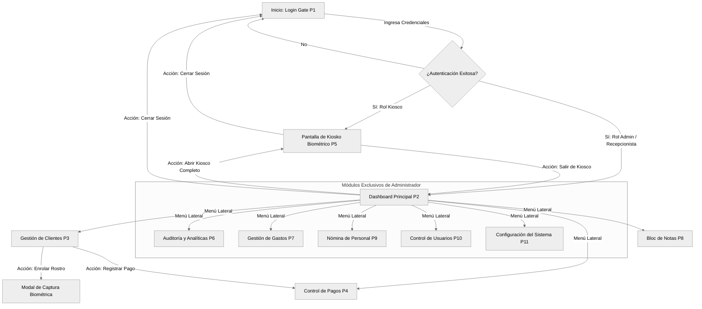
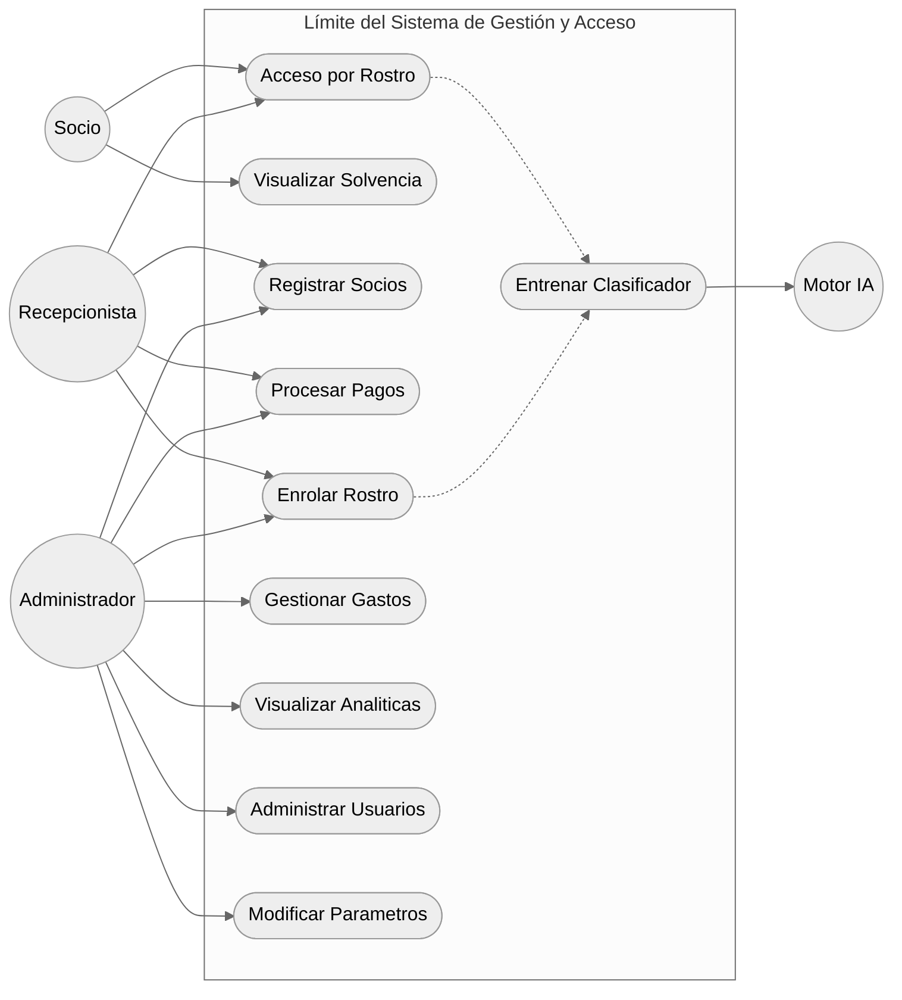
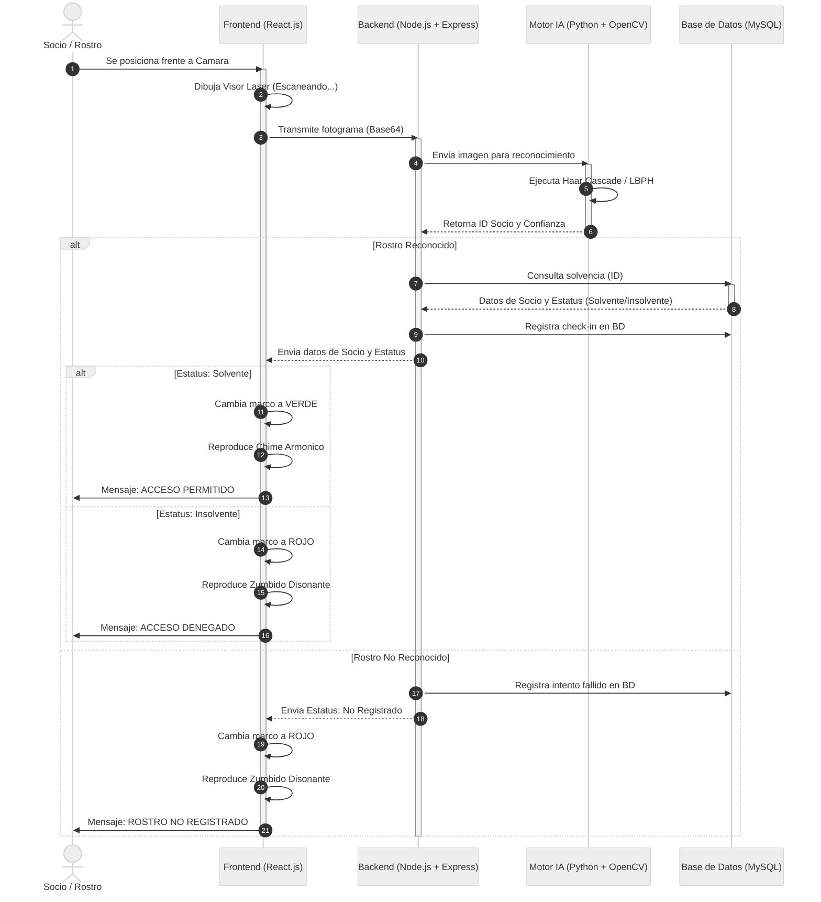
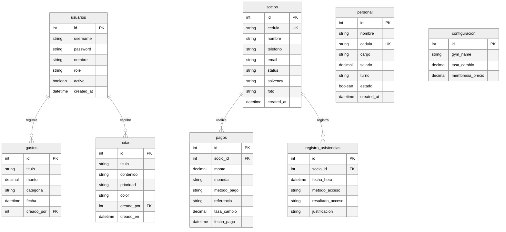

# Descripción e Interfaces de Pantallas del Sistema (Versión Tesis Definitiva)

Este documento contiene la recopilación oficial de las pantallas del sistema de grado **"BIOMETRÍA FACIAL PARA LA GESTIÓN ADMINISTRATIVA Y DE ACCESO DE LOS USUARIOS EN LOS CENTROS DEPORTIVOS DEL MUNICIPIO CABIMAS"** de **Br. Luis Ramos**.

Cada sección incluye el texto de descripción formal exacto definido para el proyecto de tesis, seguido de su respectiva maqueta de diseño básica (wireframe) en fondo claro con elementos genéricos (títulos, botones, textos, enlaces, campos de entrada, etc.), cumpliendo con los estándares académicos y metodológicos exigidos por el jurado.

---

## 1. Módulos y Pantallas del Sistema

### Pantalla 1: Pantalla de Autenticación (Login Gate)
La pantalla de inicio de sesión actúa como la primera barrera de seguridad de la plataforma, diseñada bajo una estética moderna que proporciona una experiencia de usuario profesional. Este componente restringe el acceso no autorizado mediante la validación de credenciales cifradas y realiza la segmentación administrativa de acuerdo a los roles predefinidos en la base de datos (Administrador o Recepcionista). Dependiendo del usuario autenticado, el sistema fuerza la visualización exclusiva de los datos de la sede asignada, garantizando la confidencialidad de la información. Además, la interfaz incluye botones de simulación rápida para agilizar las pruebas y demostraciones del ecosistema tecnológico.

---

### Pantalla 2: Dashboard Analítico y Panel de Inicio
El panel principal de control representa la central de mando operativa para la gerencia y los recepcionistas autorizados, ofreciendo una visualización agregada y en tiempo real del estado del centro deportivo. Esta pantalla incorpora tarjetas informativas dinámicas con contadores de socios activos, clientes insolventes y el total de ingresos recaudados en la jornada. Un elemento destacado de esta interfaz es el gráfico de afluencia horaria, el cual procesa el historial de asistencias biométricas para identificar con precisión las horas pico. Esta herramienta analítica resulta vital para optimizar la administración del personal y la distribución de clases en el establecimiento físico.

---

### Pantalla 3: Módulo de Gestión de Clientes
Esta interfaz centraliza el directorio completo de los socios afiliados al establecimiento y permite realizar todas las operaciones de gestión sobre la base de datos de manera intuitiva. El listado de clientes se expone en una tabla interactiva que incluye filtros de búsqueda por nombre o número de cédula, agilizando la localización de expedientes. Cada registro presenta la información del socio, su estatus de solvencia y botones de acción rápida, destacando la función de enrolamiento facial. Al accionar este comando, se despliega un visor que captura el rostro del usuario y actualiza inmediatamente el modelo matemático en el motor de inteligencia artificial.

---

### Pantalla 4: Módulo de Control de Pagos y Facturación
Este módulo está dedicado al control financiero de las mensualidades y la reactivación de las membresías, siendo un componente clave para la rentabilidad del centro deportivo. La pantalla permite al recepcionista seleccionar un socio, visualizar su tarifa base y registrar transacciones especificando el método de pago y la referencia bancaria. Al confirmar una operación, el backend calcula automáticamente la nueva fecha de vencimiento y actualiza el estatus del cliente de insolvente a solvente en tiempo real. Adicionalmente, muestra un historial cronológico de los pagos procesados en el día, garantizando la auditoría transparente de cada ingreso monetario.

---

### Pantalla 5: Kiosko Biométrico
Constituye el núcleo operativo del sistema en la recepción del gimnasio, diseñado para ejecutarse a pantalla completa como un Kiosco interactivo de validación. La interfaz muestra la transmisión en vivo de la cámara web, acompañada de indicadores visuales que reaccionan dinámicamente según el dictamen del motor de inteligencia artificial. Cuando un cliente se posiciona frente a la cámara, el sistema localiza el rostro y evalúa su solvencia en milisegundos. Si el acceso es autorizado, el marco emite una confirmación visual en color verde; si el usuario es desconocido o se encuentra insolvente, la pantalla alerta en color rojo, impidiendo inmediatamente el paso.

---

### Pantalla 6: Módulo de Auditoría y Analíticas de Negocio
Este componente avanzado está diseñado específicamente para la toma de decisiones gerenciales y la auditoría rigurosa de la seguridad del recinto. La pantalla integra selectores de rango de fechas que permiten realizar consultas estructuradas al histórico de asistencias y transacciones almacenado en la base de datos MySQL. La información procesada se visualiza mediante indicadores clave de rendimiento (KPIs), tales como el promedio de visitas diarias y los niveles de retención de clientes. Adicionalmente, incluye una bitácora detallada que documenta cada intento de acceso, registrando la hora exacta, el método de autenticación y la justificación técnica en caso de rechazo, garantizando así un control absoluto sobre el flujo de usuarios.

---

### Pantalla 7: Módulo de Registro de Gastos y Egresos
Esta interfaz administrativa, reservada exclusivamente para el rol gerencial, permite documentar y gestionar todos los costos operativos asociados al mantenimiento de las instalaciones deportivas. A través de un formulario estructurado, el usuario puede introducir conceptos de gastos, categorizarlos y registrar los montos debitados. El sistema procesa estos egresos y los contrasta de forma automatizada con la recaudación total de las membresías, desplegando un balance neto que calcula el rendimiento financiero en tiempo real. Esta herramienta analítica facilita a los propietarios la evaluación de la rentabilidad de cada sede en el municipio Cabimas, manteniendo un control contable estricto y libre de hojas de cálculo externas.

---

### Pantalla 8: Bloc de Notas Administrativas
Concebida como una herramienta asíncrona de comunicación interna, esta pantalla optimiza la coordinación operativa entre los recepcionistas y administradores durante los diferentes turnos de trabajo. La interfaz simula un tablero digital donde el personal puede anclar tarjetas informativas con recordatorios críticos, reportes de fallas en los equipos o directrices gerenciales. Estos registros se almacenan de manera persistente en la base de datos y admiten operaciones de edición rápida, categorización por niveles de prioridad y eliminación tras su resolución. Su diseño dinámico mejora significativamente la organización del talento humano en la recepción, asegurando que las novedades del centro deportivo se transmitan sin interrupciones.

---

### Pantalla 9: Personal y Nómina del Gimnasio
Este panel administrativo centraliza el registro y control del talento humano que opera en los centros deportivos, abarcando a instructores, personal de limpieza y recepcionistas. La interfaz detalla la información de contacto de cada empleado, su cargo asignado, el turno laboral y el salario mensual estructurado en base a la tasa cambiaria vigente. La plataforma automatiza el cálculo de las liquidaciones o pagos de nómina apoyándose en las variables globales del sistema y en el registro de asistencia del propio personal. Además, incorpora filtros de búsqueda por departamento y sede, dotando a la gerencia de una herramienta robusta para la supervisión eficiente de los recursos humanos.

---

### Pantalla 10: Seguridad y Cuentas de Usuarios
Representando la consola central de seguridad informática de la plataforma, esta sección opera bajo el modelo de Control de Acceso Basado en Roles (RBAC) y el principio de menor privilegio. A través de esta interfaz, el administrador principal puede crear nuevas credenciales para los recepcionistas y restringir su acceso exclusivamente a la sede física correspondiente (ExtremoGym, Booster o CrunchGym). La pantalla despliega una tabla de auditoría con los nombres de usuario, roles y estados de cuenta, facilitando acciones críticas como el restablecimiento de contraseñas o la suspensión de perfiles. Esta segmentación previene que personal no autorizado altere las configuraciones globales o visualice datos financieros ajenos a su jurisdicción.

---

### Pantalla 11: Configuración del Sistema
Esta pantalla de configuración paramétrica define el comportamiento lógico y financiero de todo el ecosistema tecnológico en tiempo real. Su acceso es estrictamente gerencial y permite establecer las variables fundamentales del modelo de negocio, tales como la tasa oficial de cambio monetario y las tarifas base de las membresías. Estos parámetros se almacenan en una tabla dedicada dentro de la base de datos relacional y son consumidos dinámicamente por los demás módulos para calcular vencimientos y conversiones de divisas. La interfaz cuenta con validaciones estrictas de entrada para evitar errores tipográficos que puedan alterar la contabilidad o comprometer la integridad de la facturación automatizada.

---

## 2. Diagramas del Sistema (Modo Claro / Blanco)

A continuación se presentan los diagramas lógicos y de flujo del sistema configurados en **modo claro (tema neutral)** para su correcta impresión e integración en el informe escrito de la tesis.

### Diagrama 1: Mapa de Navegación del Sistema

Este diagrama ilustra el flujo de pantallas y las transiciones lógicas del usuario desde el inicio de sesión hasta las distintas vistas administrativas y de operación en modo Kiosco.

---

### Diagrama 2: Diagrama de Casos de Uso

Define los límites del sistema y los permisos operativos de los actores del sistema: **Socio**, **Recepcionista**, **Administrador** y el **Motor de Visión Artificial (Python)**.

---

### Diagrama 3: Diagrama de Secuencia (Acceso Biométrico)

Detalla el flujo en milisegundos para la captura del fotograma facial, la validación del modelo LBPH en el motor IA, y la consulta de solvencia en MySQL con retorno auditivo y visual.

---

### Diagrama 4: Diagrama Entidad-Relación (Base de Datos MySQL)

Representa la arquitectura de almacenamiento de datos relacional montada bajo XAMPP MySQL.

