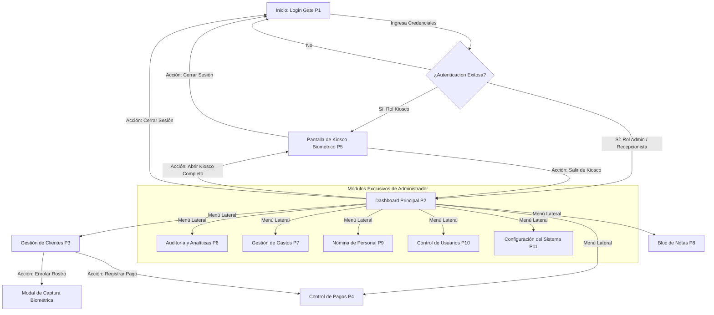
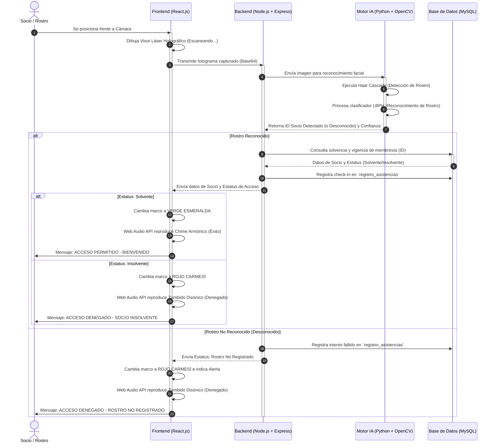
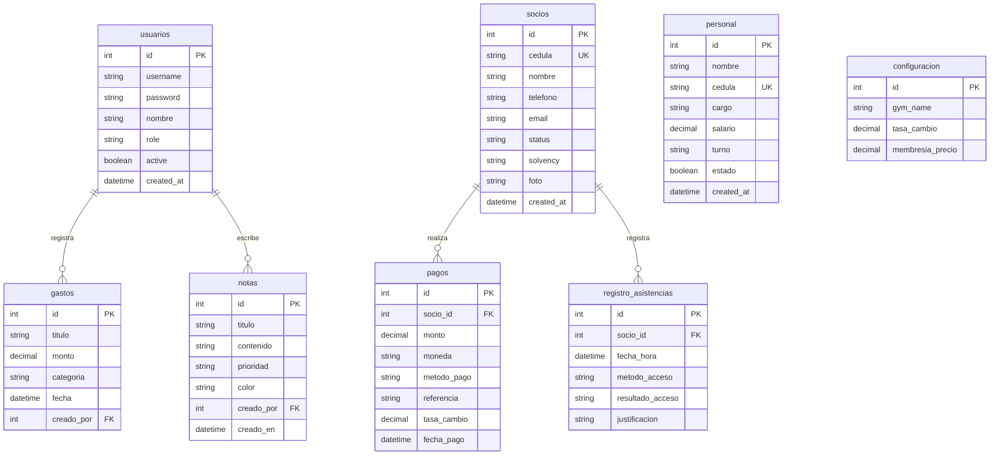

# Guía de Interfaces de Usuario, Wireframes y Diagramas de Tesis

Este documento ha sido elaborado especialmente para la tesis de grado titulada **"BIOMETRÍA FACIAL PARA LA GESTIÓN ADMINISTRATIVA Y DE ACCESO DE LOS USUARIOS EN LOS CENTROS DEPORTIVOS DEL MUNICIPIO CABIMAS"** de **Br. Luis Ramos** (Ingeniería de Sistemas, IUP Santiago Mariño, Extensión COL-Cabimas).

Contiene la descripción académica detallada de todas las pantallas, sus wireframes en formato estructurado simple y los diagramas arquitectónicos y lógicos representados tanto en lenguaje descriptivo como en código **Mermaid** (para renderización automática de alta definición).

---

## 1. Descripciones Académicas de las Pantallas del Sistema
A continuación, se detalla cada una de las 11 pantallas de la plataforma en un formato formal y descriptivo de 6 a 12 líneas, enfocándose en su función técnica, propósito en los centros deportivos (*ExtremoGym*, *Booster Gym*, *CrunchGym*) y su interacción con los servicios de backend, base de datos local y motor de visión artificial.

### P1: Compuerta de Autenticación / Acceso Administrativo (Login Gate)
La pantalla de inicio de sesión o Login Gate actúa como la primera barrera de seguridad de la plataforma, diseñada bajo una estética premium de modo oscuro que proporciona una experiencia de usuario moderna y profesional. Este componente restringe el acceso no autorizado mediante la validación de credenciales (nombre de usuario y contraseña) cifradas, y realiza la segmentación administrativa de acuerdo a los roles predefinidos en la base de datos MySQL (Administrador o Recepcionista). Dependiendo del usuario autenticado, el sistema bloquea o permite el selector de sedes en la parte superior derecha, forzando la visualización exclusiva de los datos de la sede asignada (ExtremoGym, Booster o CrunchGym) para garantizar la integridad y confidencialidad de la información. Además, la pantalla incluye botones de simulación con un solo clic que autocompletan las credenciales demo de Luis Ramos o María Gómez, agilizando las pruebas y demostraciones en tiempo real ante el jurado examinador de la tesis.

### P2: Dashboard Analítico / Panel de Inicio (Analytical Dashboard)
El panel principal de control o Dashboard representa la central de mando operativa para el administrador y los recepcionistas autorizados, ofreciendo una visualización agregada y en tiempo real del estado del centro deportivo. Esta pantalla incorpora tarjetas informativas dinámicas con contadores de socios activos, clientes insolventes, y el total de ingresos recaudados en el día expresado tanto en bolívares como en divisas según la tasa de cambio vigente. En la parte superior, se muestran indicadores de telemetría de red que verifican la conexión con la base de datos de XAMPP y con el servicio Flask de reconocimiento facial de Python en tiempo real. Un elemento destacado es el gráfico de afluencia horaria programado con barras CSS interactivas, que procesa el historial de check-ins para identificar las "horas pico" y optimizar la administración del personal y la distribución de clases en el establecimiento.

### P3: Módulo de Gestión de Clientes (Directorio de Socios)
Esta interfaz centraliza el directorio completo de los socios afiliados al establecimiento deportivo y permite realizar todas las operaciones CRUD (Creación, Lectura, Actualización y Eliminación) sobre la base de datos de manera intuitiva. El listado de clientes se muestra en una tabla interactiva con filtros de búsqueda rápida por nombre o cédula, y selectores de filtrado por estatus de membresía (activo/inactivo) y solvencia de pago. Cada fila de la tabla presenta la información personal del socio, su fotografía de perfil, y una barra de acciones rápidas que contiene botones para editar la ficha del cliente, registrar un pago, eliminar su registro o abrir la cámara para enrolar su rostro. Esta última acción abre un visor interactivo que captura la cara del usuario y actualiza de inmediato el modelo matemático del motor biométrico, facilitando la administración de las identidades de manera ágil.

### P4: Módulo de Control de Pagos y Membresías (Facturación)
Este módulo está dedicado al control financiero de las mensualidades y la reactivación de las membresías vencidas, siendo un componente clave para el flujo de caja del centro deportivo. La pantalla le permite al recepcionista seleccionar un socio de la lista, visualizar su saldo pendiente, su tarifa base y registrar transacciones especificando el método de pago (Pago Móvil, Transferencia, Divisas en efectivo o Bolívares). Al confirmar una transacción, el backend calcula automáticamente la nueva fecha de vencimiento sumando 30 días calendario y actualiza el estatus de solvencia del socio de insolvente a solvente en la tabla correspondiente de MySQL. La pantalla muestra un historial cronológico de los pagos procesados en el día, detallando la fecha, la referencia bancaria, el monto abonado y el usuario administrativo que recibió el dinero, garantizando la auditoría de cada transacción.

### P5: Control de Acceso Biométrico / Recepción (Escáner de Acceso)
Constituye el núcleo operativo del sistema en la recepción del gimnasio, diseñado para ejecutarse a pantalla completa como un Kiosco interactivo o como un panel integrado en el dashboard administrativo. La interfaz muestra la transmisión en vivo de la cámara web decorada con un visor holográfico y una animación láser verde o roja que se activa dinámicamente según la respuesta del motor biométrico. Cuando un cliente se posiciona frente a la cámara, el backend envía la imagen al script de Python, el cual localiza la cara y realiza el emparejamiento con el clasificador LBPH, devolviendo el ID y el estatus de solvencia en milisegundos. Si el acceso es autorizado, el marco parpadea en verde esmeralda y emite un chime audible de dos tonos armónicos; si es denegado o insolvente, el marco se torna rojo carmesí emitiendo un zumbido lineal e impidiendo el paso.

### P6: Módulo de Auditoría y Analíticas de Negocio (Estadísticas Avanzadas)
Este componente avanzado está diseñado específicamente para la toma de decisiones gerenciales y la auditoría de seguridad, reuniendo reportes analíticos derivados del uso de la plataforma. La pantalla cuenta con selectores de rango de fecha que permiten realizar consultas estructuradas al histórico de asistencias y transacciones financieras registradas en la base de datos. La información procesada se expone mediante indicadores de rendimiento (KPIs) sobre el porcentaje de retención de clientes, el promedio de visitas diarias y una lista de los socios más frecuentes de cada sede. Adicionalmente, incluye un visor de bitácora detallado que documenta cada intento de acceso, indicando la fecha, la hora exacta, el nombre del socio, el método de acceso (biométrico o simulado) y la justificación técnica en caso de denegación.

### P7: Módulo de Registro de Gastos y Egresos (Administración Financiera)
Esta interfaz administrativa está reservada para el rol de administrador, permitiendo documentar todos los costos operativos asociados con el mantenimiento de las instalaciones y el personal del gimnasio. A través de un formulario dedicado, el usuario puede introducir el título del gasto, la categoría (servicios, mantenimiento, compras de equipos, insumos), la fecha de la transacción y el monto debitado en divisas o moneda local. El sistema procesa estos egresos y los contrasta automáticamente con la recaudación total de las membresías, desplegando un balance neto que calcula el rendimiento financiero del gimnasio en tiempo real. Esta vista ayuda a los propietarios a evaluar la rentabilidad real de cada sede del Municipio Cabimas y mantener un control financiero estricto, libre de intermediarios o hojas de cálculo externas propensas a errores.

### P8: Bloc de Notas Administrativas (Notes)
Es una herramienta de comunicación interna diseñada para facilitar la coordinación entre los recepcionistas y administradores que operan el sistema en diferentes turnos de trabajo. La pantalla simula un tablero de notas interactivas en el cual se pueden añadir tarjetas informativas con recordatorios sobre clientes insolventes, fallas reportadas en los equipos, o directrices de la gerencia. Las notas se guardan de forma persistente en la base de datos local y admiten operaciones de edición rápida, marcado de prioridad y eliminación una vez que el asunto ha sido resuelto. Su estilo visual dinámico, que imita notas adhesivas con códigos de colores sobre la interfaz holográfica del sistema, mejora la organización del personal en la recepción y asegura que los avisos urgentes no se pierdan.

### P9: Personal y Nómina del Gimnasio (Recursos Humanos)
Este panel administrativo centraliza el registro del personal de trabajo, incluyendo instructores de entrenamiento, personal de limpieza, administradores y personal de recepción del gimnasio. En él se especifican los datos de contacto del empleado, su cargo asignado, el horario de su turno, su estado activo y su salario mensual estructurado con base en la tasa cambiaria del día. La pantalla calcula de forma automatizada las liquidaciones o pagos quincenales basándose en las variables globales de configuración del sistema y en la asistencia registrada para el personal administrativo. Permite además el filtrado de la nómina por departamento y sede asignada, proporcionando al administrador una herramienta centralizada para la supervisión y control del equipo humano de los centros deportivos.

### P10: Seguridad / Cuentas de Usuarios (Access Control List)
Esta sección representa la consola de seguridad informática de la plataforma, diseñada bajo el principio de menor privilegio y control de acceso basado en roles (RBAC). A través de esta interfaz, el administrador puede crear nuevas cuentas de acceso para recepcionistas y asignarles de forma restrictiva una sede física (por ejemplo, Booster Gym o CrunchGym). La pantalla muestra una tabla detallada con los nombres de usuario, roles, fechas de creación de cuenta y el estado de la cuenta (activa/suspendida), permitiendo realizar acciones rápidas de restablecimiento de contraseñas. Al centralizar la gestión de credenciales en esta vista, se previene que personal no autorizado modifique los privilegios del sistema o visualice la facturación total de otras sedes deportivas ajenas a su área de trabajo.

### P11: Configuración del Sistema (Parámetros Globales)
Esta pantalla de control de parámetros globales es de acceso exclusivo para el rol de administrador y define el comportamiento lógico de toda la plataforma en tiempo real. En ella se configuran los valores fundamentales del negocio, tales como el nombre principal del establecimiento deportivo, la tasa oficial de cambio del dólar respecto al bolívar, y las tarifas bases de las diferentes membresías ofrecidas. Estos parámetros se guardan directamente en una tabla dedicada de la base de datos MySQL y son consumidos por el resto de los módulos para calcular las conversiones monetarias y los vencimientos de pagos. La pantalla cuenta con validaciones integradas para asegurar que las tasas cambiarias y los precios ingresados sean coherentes y no contengan errores tipográficos que alteren la contabilidad.

---

## 2. Wireframes de las Pantallas (Formato Estructurado Simple)
Los siguientes esquemas muestran la disposición espacial de los elementos de la interfaz en modo texto para servir como base rápida de diseño visual de la tesis de grado.

### Representaciones Visuales de los Wireframes Generados (Maquetas IA)
Para complementar el diseño esquemático, a continuación se presentan las maquetas visuales (wireframes) de las pantallas principales del sistema generadas por inteligencia artificial:

```carousel

<!-- slide -->

<!-- slide -->

<!-- slide -->

```

### P1: Compuerta de Autenticación / Login Gate
```text
+-------------------------------------------------------------------+
|                       SISTEMA DE BIOMETRÍA                        |
|                                                                   |
|         +-----------------------------------------------+         |
|         |                   INICIAR SESIÓN              |         |
|         |                                               |         |
|         |  [Icono de Gimnasio/Membresía]                |         |
|         |                                               |         |
|         |  Usuario:                                     |         |
|         |  [_________________________________________]  |         |
|         |                                               |         |
|         |  Contraseña:                                  |         |
|         |  [*****************************************]  |         |
|         |                                               |         |
|         |  [  BOTÓN: Acceder al Sistema  ]              |         |
|         +-----------------------------------------------+         |
|                                                                   |
|   Accesos Rápidos Demo (1-Clic):                                  |
|   [ BOTÓN: Luis Ramos (Admin) ]   [ BOTÓN: María Gómez (Recep) ]  |
|                                                                   |
|                     Tesis Luis Ramos • Cabimas                    |
+-------------------------------------------------------------------+
```

### P2: Dashboard Analítico / Panel de Inicio
```text
+-------------------------------------------------------------------+
| [Icono] RamosGym   | Buscar socio... [ ]   Tasa: Bs. 114.00  [Sola]  [Luna] |
+--------------------+----------------------------------------------+
| [Menu]             | BIENVENIDO, LUIS RAMOS (Administrador)       |
|  * Inicio          +----------------------------------------------+
|  * Clientes        | [ SOCIOS ACTIVOS ] [ SOCIOS VENCIDOS ] [ CAJA ]|
|  * Pagos           |      124 Socios        12 Socios       $350.00|
|                    +----------------------------------------------+
| [Admin]            | GRÁFICA DE AFLUENCIA HORARIA (HORAS PICO)    |
|  * Analíticas      |                                              |
|  * Gastos          |  |                                  ██       |
|  * Notas           |  |      ██                          ██  ██   |
|  * Personal        |  |  ██  ██  ██                      ██  ██   |
|  * Usuarios        |  +--+---+---+---+---+---+---+---+---+---+----+
|  * Configuración   |    06h 08h 10h 12h 14h 16h 18h 20h 22h       |
|                    +----------------------------------------------+
|  [ Cerrar Sesión ] | BITÁCORA DE INGRESOS EN VIVO                 |
|                    | 09:30 AM - Carlos Mendoza - CrunchGym - OK    |
|                    | 09:12 AM - Rostro Desconocido - Booster - ERROR|
+--------------------+----------------------------------------------+
```

### P3: Módulo de Gestión de Clientes (Directorio de Socios)
```text
+-------------------------------------------------------------------+
| [Icono] RamosGym   | Clientes / Directorio        Tasa: Bs. 114.00 |
+--------------------+----------------------------------------------+
| [Menu]             | FILTROS:                                     |
|  * Inicio          | Buscar: [__________] Estado: [Todos v] [ + Nuevo Client]|
|  * Clientes        +----------------------------------------------+
|  * Pagos           | Foto | Nombre | Cédula  | Estatus | Acciones |
|                    +------+--------+---------+---------+----------+
| [Admin]            | [IMG]| Carlos | 12.345.6| SOLVENTE| [Cámara] |
|  * Analíticas      |      | Mendoza|         |         | [Editar] |
|  * Gastos          | [IMG]| Luis   | 24.555.1| VENCIDO | [Cámara] |
|  * Notas           |      | Ramos  |         |         | [Editar] |
|  * Personal        +------+--------+---------+---------+----------+
|  * Usuarios        | Página: [ 1 ] de 3       Mostrando 5 socios  |
|  * Configuración   +----------------------------------------------+
|                    | [ Cajón lateral: Detalle de Socio seleccionado ] |
|  [ Cerrar Sesión ] | Nombre: Carlos Mendoza  | Membresía: $20.00  |
+--------------------+----------------------------------------------+
```

### P4: Módulo de Control de Pagos y Membresías (Facturación)
```text
+-------------------------------------------------------------------+
| [Icono] RamosGym   | Membresías y Facturación     Tasa: Bs. 114.00 |
+--------------------+----------------------------------------------+
| [Menu]             | REGISTRAR PAGO DE MENSUALIDAD                |
|  * Inicio          | Socio: [ Carlos Mendoza (V-12.345.678)     v] |
|  * Clientes        | Monto Base: $ 20.00    Monto en Bs: 2.280,00  |
|  * Pagos           | Método de Pago: [ Pago Móvil               v] |
|                    | Referencia Bancaria: [______________________] |
| [Admin]            | [  BOTÓN: Procesar y Activar Membresía  ]     |
|  +----------------------------------------------------------------+
|                    | HISTORIAL DE TRANSACCIONES DE HOY            |
|                    | Socio   | Referencia | Monto ($) | Monto (Bs) |
|                    +---------+------------+-----------+------------+
|                    | C. Mendo| PM-99081   | $20.00    | Bs.2.280,00|
|                    | L. Ramos| EFECTIVO   | $20.00    | Bs.2.280,00|
|                    +---------+------------+-----------+------------+
|  [ Cerrar Sesión ] | Total Recaudado: $40.00 / Bs. 4.560,00       |
+--------------------+----------------------------------------------+
```

### P5: Control de Acceso Biométrico / Recepción
```text
+-------------------------------------------------------------------+
| [Icono] RamosGym   | Escáner de Recepción         Tasa: Bs. 114.00 |
+--------------------+----------------------------------------------+
| [Menu]             | CÁMARA DE RECONOCIMIENTO   | DETALLE DE ACCESO|
|  * Inicio          |                            |                  |
|  * Clientes        |  +----------------------+  | Socio Detectado: |
|  * Pagos           |  |                      |  | Carlos Mendoza   |
|                    |  |       [ Rostro ]     |  | Cédula: 12.345.6 |
| [Admin]            |  |    < Visor Láser >   |  | Estatus:         |
|  * Analíticas      |  |                      |  | [ SOLVENTE / OK ]|
|  * Gastos          |  +----------------------+  |                  |
|  * Notas           |   Telemetría: 15 fps       | Sede: Booster    |
|  * Personal        +----------------------------+------------------+
|  * Usuarios        | PANEL DE SIMULACIÓN (DEFENSA DE TESIS)        |
|  * Configuración   | [ Simular Solvente ]   [ Simular Insolvente ]  |
|                    | [ Simular Desconocido ]                        |
+--------------------+----------------------------------------------+
```

### P6: Módulo de Auditoría y Analíticas de Negocio
```text
+-------------------------------------------------------------------+
| [Icono] RamosGym   | Auditoría y Estadísticas     Tasa: Bs. 114.00 |
+--------------------+----------------------------------------------+
| [Menu]             | RANGO: Desde: [01/06/2026] Hasta: [15/06/2026] |
|  * Inicio          +----------------------------------------------+
|  * Clientes        | [ ACCESOS TOTALES ]  [ REBOTES DE ACCESO ]   |
|  * Pagos           |      540 Entradas          23 Denegados      |
|                    +----------------------------------------------+
| [Admin]            | AUDITORÍA DE EVENTOS DETALLADA               |
|  * Analíticas      | Fecha/Hora  | Socio    | Tipo Acceso | Estado |
|  * Gastos          +-------------+----------+-------------+--------+
|  * Notas           | 14-06 18:22 | L. Ramos | Biométrico  | PERMITI|
|  * Personal        | 14-06 18:15 | M. Pérez | Simulado    | DENEGAD|
|  * Usuarios        +-------------+----------+-------------+--------+
|  * Configuración   | [  BOTÓN: Exportar Reporte de Auditoría CSV ] |
+--------------------+----------------------------------------------+
```

### P7: Módulo de Registro de Gastos y Egresos
```text
+-------------------------------------------------------------------+
| [Icono] RamosGym   | Registro de Egresos          Tasa: Bs. 114.00 |
+--------------------+----------------------------------------------+
| [Menu]             | REGISTRAR NUEVO GASTO                        |
|  * Inicio          | Concepto: [________________________________] |
|  * Clientes        | Monto ($): [________]  Monto en Bs: [______] |
|  * Pagos           | Categoría: [ Servicios v] Fecha: [14/06/2026]|
|                    | [  BOTÓN: Guardar Egresos  ]                  |
| [Admin]            +----------------------------------------------+
|  * Analíticas      | HISTORIAL DE GASTOS                          |
|  * Gastos          | Fecha      | Concepto     | Categoría | Monto |
|  * Notas           +------------+--------------+-----------+-------+
|  * Personal        | 12-06-2026 | Luz Eléctrica| Servicios | $50.00|
|  * Usuarios        | 10-06-2026 | Cloro Piscina| Limpieza  | $25.00|
|  * Configuración   +------------+--------------+-----------+-------+
|                    | Balance Neto Actual: Recaudado - Egresos     |
|  [ Cerrar Sesión ] | Ingresos: $350.00 | Gastos: $75.00 | Neto: $275.00|
+--------------------+----------------------------------------------+
```

### P8: Bloc de Notas Administrativas (Notes)
```text
+-------------------------------------------------------------------+
| [Icono] RamosGym   | Notas de Recepción           Tasa: Bs. 114.00 |
+--------------------+----------------------------------------------+
| [Menu]             | [ + Nueva Nota ]  Buscar Nota: [___________] |
|  * Inicio          +----------------------------------------------+
|  * Clientes        | [Nota: Mantenimiento] | [Nota: Pago Pendiente]|
|  * Pagos           | La máquina de poleas  | Recordar a Juan Pérez |
|                    | requiere lubricación  | que vence su mes el  |
| [Admin]            | de cables el lunes.   | día miércoles.       |
|  * Analíticas      | Prioridad: MEDIA      | Prioridad: ALTA      |
|  * Gastos          | [Editar]  [Eliminar]  | [Editar]  [Eliminar] |
|  * Notas           +-----------------------+----------------------+
|  * Personal        | [Nota: Suministros]   |                      |
|  * Usuarios        | Comprar desinfectante |                      |
|  * Configuración   | para las mancuernas.  |                      |
|                    | Prioridad: BAJA       |                      |
|  [ Cerrar Sesión ] | [Editar]  [Eliminar]  |                      |
+--------------------+----------------------------------------------+
```

### P9: Personal y Nómina del Gimnasio
```text
+-------------------------------------------------------------------+
| [Icono] RamosGym   | Nómina y Personal            Tasa: Bs. 114.00 |
+--------------------+----------------------------------------------+
| [Menu]             | [ + Registrar Empleado ]                     |
|  * Inicio          +----------------------------------------------+
|  * Clientes        | Nombre         | Cargo      | Salario ($) | Sede |
|  * Pagos           +----------------+------------+-------------+------+
|                    | María Gómez    | Recepcionista| $ 120.00  | Boost|
| [Admin]            | Carlos Mendoza | Recepcionista| $ 120.00  | Crunc|
|  * Analíticas      | Pedro Infante  | Entrenador   | $ 180.00  | Extre|
|  * Gastos          +----------------+------------+-------------+------+
|  * Notas           | CALCULO DE NÓMINA GLOBAL                     |
|  * Personal        | Total Empleados: 3                           |
|  * Usuarios        | Egreso de Nómina Mensual: $ 420.00           |
|  * Configuración   | Equivalente en Bs: Bs. 47.880,00             |
+--------------------+----------------------------------------------+
```

### P10: Seguridad / Cuentas de Usuarios
```text
+-------------------------------------------------------------------+
| [Icono] RamosGym   | Cuentas de Usuarios          Tasa: Bs. 114.00 |
+--------------------+----------------------------------------------+
| [Menu]             | [ + Crear Nuevo Usuario del Sistema ]        |
|  * Inicio          +----------------------------------------------+
|  * Clientes        | Usuario  | Nombre      | Rol       | Sede    | Estado|
|  * Pagos           +----------+-------------+-----------+---------+-------+
|                    | admin    | Luis Ramos  | Admin     | Todas   | ACTIVO|
| [Admin]            | recep    | María Gómez | Recepcion | Booster | ACTIVO|
|  * Analíticas      | recep2   | C. Mendoza  | Recepcion | Crunch  | ACTIVO|
|  * Gastos          +----------+-------------+-----------+---------+-------+
|  * Notas           | Acciones rápidas sobre usuario seleccionado: |
|  * Personal        | [ Resetear Contraseña ]  [ Desactivar Cuenta ]|
|  * Usuarios        |                                              |
|  * Configuración   |                                              |
+--------------------+----------------------------------------------+
```

### P11: Configuración del Sistema
```text
+-------------------------------------------------------------------+
| [Icono] RamosGym   | Configuración General        Tasa: Bs. 114.00 |
+--------------------+----------------------------------------------+
| [Menu]             | PARÁMETROS BÁSICOS DEL GIMNASIO              |
|  * Inicio          | Nombre del Establecimiento:                  |
|  * Clientes        | [ RamosGym                                ]  |
|  * Pagos           |                                              |
|                    | Tasa de Cambio del Dólar (Dicom/Oficial):    |
| [Admin]            | [ Bs. 114.00                              ]  |
|  * Analíticas      |                                              |
|  * Gastos          | Tarifa Base Membresía Mensual ($):           |
|  * Notas           | [ $ 20.00                                 ]  |
|  * Personal        |                                              |
|  * Usuarios        | [  BOTÓN: Guardar y Aplicar Cambios  ]        |
|  * Configuración   |                                              |
+--------------------+----------------------------------------------+
```

---

## 3. Diagramas del Sistema

### Diagrama 1: Mapa de Navegación del Sistema (Requerido)
Este diagrama ilustra el flujo de pantallas y las transiciones lógicas que realiza un usuario desde el acceso inicial, pasando por la validación de roles hasta la navegación interna y la desconexión.



---

### Diagrama 2: Casos de Uso del Sistema (Recomendado 1)
Este diagrama define los límites del sistema, las acciones disponibles y los roles de los actores involucrados: el **Socio** (que interactúa con la biometría), el **Recepcionista** (operador diario) y el **Administrador** (quien supervisa y configura).

```mermaid
left_to_right_direction
gc[Límite del Sistema de Biometría y Gestión]
actor Socio
actor Recepcionista
actor Administrador
actor Motor_IA as "Motor IA Facial (Python)"

subgraph gc
    uc1((Acceso por Rostro))
    uc2((Visualizar Estatus Solvencia))
    uc3((Registrar Socios))
    uc4((Procesar Pagos))
    uc5((Enrolar Rostro / Capturar Fotos))
    uc6((Entrenar Clasificador LBPH))
    uc7((Gestionar Gastos))
    uc8((Visualizar Analíticas y Horas Pico))
    uc9((Administrar Usuarios del Sistema))
    uc10((Modificar Variables Globales))
end

Socio --> uc1
Socio --> uc2

Recepcionista --> uc3
Recepcionista --> uc4
Recepcionista --> uc5
Recepcionista --> uc1

Administrador --> uc3
Administrador --> uc4
Administrador --> uc5
Administrador --> uc7
Administrador --> uc8
Administrador --> uc9
Administrador --> uc10

uc1 .-> uc6 : <<include>>
uc5 .-> uc6 : <<include>>
uc6 --> Motor_IA
```

---

### Diagrama 3: Secuencia del Control de Acceso Biométrico (Recomendado 2)
Este diagrama técnico detalla el paso a paso del procesamiento en tiempo real: desde que el usuario se coloca frente a la cámara, la transferencia de imágenes entre Node.js y Python, la consulta lógica en MySQL, y la respuesta auditiva y visual.



---

### Diagrama 4: Diagrama Entidad-Relación de Base de Datos MySQL (Bonus Especial)
Como aporte de alto valor académico para el Capítulo IV o el anexo de la tesis, se incluye el modelado lógico de datos del sistema montado en XAMPP.


